# Architecture — Manufacturing Anomaly Detection

> Detailed system design, data flow, and key architectural decisions.

---

## System Overview

```mermaid
graph TB
    subgraph Data Layer
        A[NASA CMAPSS CSV Files] --> B[Data Ingestion<br/>src/data/ingest.py]
        B --> C[Data Validation<br/>src/data/validate.py]
        C --> D[Feature Engineering<br/>src/features/engineer.py]
    end

    subgraph Training Pipeline
        D --> E[Sliding Windows<br/>30 timesteps × 14 sensors]
        E --> F[LSTM Autoencoder<br/>Primary Model]
        E --> G[Isolation Forest<br/>Baseline]
        E --> H[PatchTST<br/>Transformer]
        F --> I[MLflow Experiment Tracking]
        G --> I
        H --> I
        I --> J[Model Registry<br/>Production Stage]
    end

    subgraph Serving Layer
        J --> K[AnomalyPredictor<br/>src/serving/predictor.py]
        K --> L[FastAPI<br/>src/serving/main.py]
        L --> M[POST /detect]
        L --> N[POST /detect/batch]
        L --> O[GET /health]
    end

    subgraph Storage & UI
        M --> P[(PostgreSQL<br/>anomaly_events)]
        N --> P
        P --> Q[Streamlit Dashboard<br/>dashboard/app.py]
        L --> Q
    end

    style F fill:#e8f5e9,stroke:#2e7d32
    style J fill:#e3f2fd,stroke:#1565c0
    style L fill:#fff3e0,stroke:#e65100
    style P fill:#fce4ec,stroke:#c62828
```



---

## Data Pipeline

```mermaid
flowchart LR
    subgraph Input
        RAW[train_FD001.txt<br/>26 columns per row<br/>unit_id + cycle + 3 ops + 21 sensors]
    end

    subgraph Ingestion
        RAW --> PARSE[Parse Fixed-Width<br/>Add column names]
        PARSE --> LABEL[Label Anomalies<br/>RUL < 30 → anomaly]
        LABEL --> TS[Add Timestamps<br/>1 row = 1 second]
    end

    subgraph Validation
        TS --> V1[Column Check]
        V1 --> V2[Null Detection]
        V2 --> V3[Type Validation]
        V3 --> V4[Range Checks]
        V4 --> V5[Temporal Order]
    end

    subgraph Feature Engineering
        V5 --> DROP[Drop Low-Variance<br/>Sensors 1,5,6,10,16,18,19]
        DROP --> ROLL[Rolling Stats<br/>mean/std over 5,10,20]
        ROLL --> NORM[Min-Max Normalization]
        NORM --> WIN[Sliding Windows<br/>30 × 14 features]
    end

    WIN --> TRAIN[Training Pipeline]
    WIN --> SERVE[Serving Pipeline]
```



### Key Decision: Shared Feature Engineering

The **same** `src/features/engineer.py` module is used in both training and serving:


This prevents feature skew between training and inference — a common source of silent model degradation in production ML systems.

---

## Model Architectures

### LSTM Autoencoder (Primary)

```mermaid
graph LR
    subgraph Encoder
        I[Input<br/>30 × 14] --> E1[LSTM Layer 1<br/>hidden=64]
        E1 --> E2[LSTM Layer 2<br/>hidden=64]
        E2 --> BN[Bottleneck<br/>Linear → 32d]
    end

    subgraph Decoder
        BN --> D1[Linear → 64d]
        D1 --> D2[LSTM Layer 1<br/>hidden=64]
        D2 --> D3[LSTM Layer 2<br/>hidden=64]
        D3 --> OUT[Output<br/>30 × 14]
    end

    subgraph Anomaly Detection
        I --> DIFF{MSE Loss}
        OUT --> DIFF
        DIFF --> SCORE[Reconstruction Error]
        SCORE --> THR{Score > Threshold?}
        THR -->|Yes| ANOM[🔴 Anomaly]
        THR -->|No| NORM[🟢 Normal]
    end

    style BN fill:#e8f5e9,stroke:#2e7d32
    style ANOM fill:#ffcdd2,stroke:#c62828
    style NORM fill:#c8e6c9,stroke:#2e7d32
```



**Why reconstruction error works:** The autoencoder is trained exclusively on *normal* sensor patterns. When it encounters degraded/anomalous readings, it cannot reconstruct them accurately → high MSE → anomaly detected.

### Isolation Forest (Baseline)

```mermaid
graph TD
    INPUT[Flattened Window<br/>30×14 = 420 features] --> TREE1[Random Tree 1]
    INPUT --> TREE2[Random Tree 2]
    INPUT --> TREEN[Random Tree N<br/>n=200]

    TREE1 --> AVG[Average Path Length]
    TREE2 --> AVG
    TREEN --> AVG

    AVG --> SCORE[Anomaly Score<br/>Short path = anomaly]
    SCORE --> THR{Score > Threshold?}
    THR -->|Yes| ANOM[🔴 Anomaly]
    THR -->|No| NORM[🟢 Normal]

    style SCORE fill:#fff9c4,stroke:#f9a825
```



### PatchTST (Transformer)

```mermaid
graph LR
    subgraph Patching
        I[Input<br/>30 × 14] --> P1[Patch 1<br/>8 steps]
        I --> P2[Patch 2<br/>8 steps]
        I --> PN[Patch N<br/>8 steps]
    end

    subgraph Transformer
        P1 --> EMB[Patch Embedding<br/>d_model=64]
        P2 --> EMB
        PN --> EMB
        EMB --> PE[+ Positional Encoding]
        PE --> ATT1[Encoder Layer 1<br/>4 heads]
        ATT1 --> ATT2[Encoder Layer 2]
        ATT2 --> ATT3[Encoder Layer 3]
    end

    subgraph Forecasting
        ATT3 --> FC[Linear Head]
        FC --> PRED[Forecast<br/>Next 10 steps]
    end

    subgraph Anomaly Detection
        PRED --> DIFF{Forecast Error}
        ACTUAL[Actual Future] --> DIFF
        DIFF --> SCORE[Anomaly Score]
    end

    style ATT1 fill:#e3f2fd,stroke:#1565c0
```



---

## MLflow Integration


### Threshold Optimization

```mermaid
graph LR
    SCORES[Anomaly Scores<br/>on validation set] --> SWEEP[Threshold Sweep<br/>0.01 → 1.0<br/>100 steps]
    SWEEP --> F1[Compute F1 at<br/>each threshold]
    F1 --> BEST[Select threshold<br/>with max F1]
    BEST --> LOG[Log to MLflow<br/>as best_threshold]

    style BEST fill:#fff9c4,stroke:#f9a825
```



---

## Serving Architecture

```mermaid
graph TB
    subgraph FastAPI Application
        REQ[HTTP Request] --> MW1[Request Logging<br/>Middleware]
        MW1 --> MW2[Timing<br/>Middleware]
        MW2 --> VAL[Pydantic<br/>Validation]

        VAL -->|Valid| ROUTER[Router]
        VAL -->|Invalid| E422[422 Error]

        ROUTER --> DETECT[/detect]
        ROUTER --> BATCH[/detect/batch]
        ROUTER --> HEALTH[/health]

        DETECT --> PRED[AnomalyPredictor]
        BATCH --> PRED

        PRED --> SCALE[Normalize Window<br/>engineer.py scaler]
        SCALE --> MODEL[Model Forward Pass]
        MODEL --> SCORE[Score + Threshold]
        SCORE --> RESP[JSON Response]
    end

    subgraph Model Loading Priority
        PRED -.-> ML1[1. MLflow Registry<br/>Production stage]
        PRED -.-> ML2[2. MLflow Run Artifact<br/>Latest run]
        PRED -.-> ML3[3. Local Checkpoint<br/>data/artifacts/]
    end

    RESP --> DB[(PostgreSQL<br/>anomaly_events)]
    RESP --> CLIENT[Client]

    style PRED fill:#e3f2fd,stroke:#1565c0
    style E422 fill:#ffcdd2,stroke:#c62828
```

### Request/Response Flow


---

## Docker Deployment

```mermaid
graph TB
    subgraph Docker Compose — anomaly-net
        PG[(PostgreSQL 15<br/>:5432<br/>anomaly_events)]
        ML[MLflow Server<br/>:5000<br/>Experiment UI]
        API[FastAPI<br/>:8000<br/>Model Serving]
        ST[Streamlit<br/>:8501<br/>Dashboard]
    end

    PG ---|health check:<br/>pg_isready| API
    ML ---|model artifacts| API
    API ---|health check:<br/>curl /health| ST
    API ---|HTTP calls| ST

    subgraph Volumes
        PGV[postgres_data] -.-> PG
        MLV[mlflow_data] -.-> ML
    end

    subgraph Security
        SEC[All containers run<br/>as non-root user<br/>UID 1000]
    end

    style PG fill:#fce4ec,stroke:#c62828
    style ML fill:#e3f2fd,stroke:#1565c0
    style API fill:#fff3e0,stroke:#e65100
    style ST fill:#e8f5e9,stroke:#2e7d32
```

### Container Startup Order


Health checks ensure services only accept traffic after dependencies are ready:
- **PostgreSQL:** `pg_isready` every 10s
- **FastAPI:** `curl /health` every 30s
- **Streamlit:** `/_stcore/health` endpoint

---

## CI/CD Pipeline

```mermaid
graph LR
    subgraph GitHub Actions
        PUSH[Push / PR<br/>to main] --> LINT[Lint Stage<br/>ruff check + format]
        LINT -->|Pass| TEST[Test Stage<br/>pytest + coverage ≥80%]
        TEST -->|Pass| BUILD[Build Stage<br/>Docker images]
        BUILD -.->|Future| PUSH_ECR[Push to ECR]
    end

    style PUSH_ECR fill:#f5f5f5,stroke:#bdbdbd,stroke-dasharray: 5 5
```



---

## Key Design Decisions

| Decision | Rationale |
|---|---|
| **LSTM-AE as primary model** | Best interpretability via reconstruction error visualization; demonstrates PyTorch custom training loop |
| **Train on normal data only** | Autoencoder learns the "healthy" distribution; anomalies are defined as high reconstruction error from that norm |
| **Isolation Forest as baseline** | Fast, non-parametric, no GPU needed — establishes performance floor to beat |
| **PatchTST as differentiator** | Shows awareness of SOTA time-series transformers; forecasting-based anomaly detection is complementary |
| **Shared feature engineering** | Single `engineer.py` prevents train/serve skew — the #1 cause of silent ML production failures |
| **Config-driven architecture** | All hyperparameters in `configs/*.yaml` — never hardcoded in source |
| **MLflow for everything** | Params, metrics, artifacts, and model registry in one tool — enables reproducible experiments |
| **Pydantic strict validation** | FastAPI returns 422 (not 500) on bad input — explicit types, no `Any` |
| **Non-root Docker containers** | Security best practice for production deployment |
| **PostgreSQL for events** | Durable anomaly history enables trend analysis, alerting, and audit trails |
